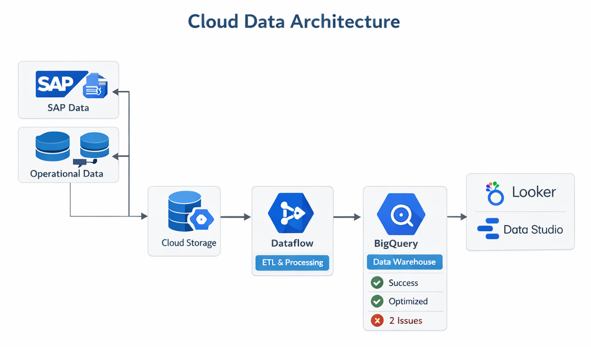

# 🌐 Xperiences — Cloud Data Engineering Portfolio

[](https://cloud.google.com/)
[](https://www.python.org/)
[](https://cloud.google.com/bigquery)
[](https://github.com/features/actions)
[](https://looker.com/)

This repository showcases an **end-to-end, cloud-native data engineering solution** built on **Google Cloud Platform (GCP)**.  
It demonstrates how enterprise SAP and operational data can be ingested, transformed, governed, and delivered as **executive-ready analytics**.

---

## 🎯 Business Objectives

- Translate complex business requirements into **scalable cloud data pipelines**
- Ingest **SAP Finance** and **operational datasets** into a unified analytics platform
- Optimize **query performance and cloud costs**
- Enable **executive decision-making** through curated dashboards
- Apply **software engineering best practices** to data pipelines

---

## 🏗️ High-Level Architecture




**Flow:**

SAP & Operational Sources  
→ Cloud Storage  
→ Python-based ETL ingestion  
→ BigQuery (staging → unified facts)  
→ Analytics & cost optimization queries  
→ Looker / Data Studio dashboards  

Orchestration is handled via **Airflow (Cloud Composer)**.

---

## 🗂️ Repository Structure
├── data/ # Mock SAP & operational source data
├── etl/ # Python ingestion & SQL transformations
├── analytics/ # Performance & cost optimization queries
├── orchestration/ # Airflow DAGs (Cloud Composer)
├── tests/ # Data quality & pipeline tests
├── powerbi/ # Executive dashboard screenshots
├── docs/ # Architecture & governance documentation
└── .github/ # CI/CD workflows

---

## 🔄 ETL Design

### 1️⃣ Ingestion (Python)

- Handles source extraction and ingestion
- Loads data into BigQuery staging tables
- Includes logging and error handling
- Cloud SDK–based (production-ready)

📄 `etl/etl_ingestion.py`

---

### 2️⃣ Transformation (SQL)

- Unifies SAP and operational data
- Normalizes schemas and business statuses
- Produces analytics-ready fact tables

📄 `etl/transformations.sql`

Example logic:
- Multi-source union
- Business rule mapping
- Status normalization
- Source lineage tagging

---

## ⏱️ Orchestration

- Managed via **Airflow (Cloud Composer)**
- Daily scheduled pipelines
- Clear separation of ingestion and transformation tasks

📄 `orchestration/airflow_dag.py`

This mirrors **enterprise scheduling patterns** used in production environments.

---

## 📊 Analytics & Performance Layer

The `analytics/` folder contains **business-facing SQL queries** built on top of the unified fact table (`unified_fact`).  
These queries are designed to support **cost optimization, operational monitoring, and executive reporting**.

### 📁 analytics/
---

---

### 💰 Cost Efficiency Analysis

📄 `analytics/cost_efficiency.sql`

This query analyzes **financial efficiency by department**, helping identify areas of high spend and optimization opportunities.

**Metrics produced:**
- Total spend per department
- Record volumes
- Average spend per transaction

**Business use cases:**
- Cost optimization initiatives
- Departmental budget reviews
- Executive cost transparency

Example logic:
```sql
SELECT
    department,
    SUM(amount) AS total_spend,
    COUNT(*) AS record_count,
    AVG(amount) AS avg_spend
FROM unified_fact
GROUP BY department;
---


## 📈 Executive Dashboard Preview


**Dashboard Features:**
- KPI cards (Revenue, Collections, PTPs, Cost Savings)
- Trend analysis over time
- Cost optimization metrics
- Pipeline health indicators

Dashboards are designed for **senior leadership consumption**.

---

## 🧪 Testing & Data Quality

📁 `tests/`

- Schema validation
- Basic data quality checks
- CI-integrated testing

Example:
- No negative financial values
- Required columns enforced
- Prevents bad data from reaching analytics layers

---

## 🔁 CI/CD & DevOps

- Automated via **GitHub Actions**
- Runs on every pull request
- Validates Python and SQL assets
- Enforces engineering discipline for data pipelines

📄 `.github/workflows/ci.yml`

---

## 🔐 Data Governance & Design Decisions

📁 `docs/`

- Data lineage and source traceability
- Status standardization logic
- Reproducible transformations
- Analytics-ready data modeling

Governance principles:
- Auditability
- Reusability
- Scalability
- Security-by-design

---

## ☁️ Cloud Portability

This solution is **cloud-agnostic by design**.

| Layer | GCP | AWS | Azure |
|----|----|----|----|
| Storage | GCS | S3 | ADLS |
| ETL | Dataflow | Glue | Data Factory |
| Orchestration | Composer | MWAA | ADF |
| Warehouse | BigQuery | Redshift | Synapse |
| BI | Looker | QuickSight | Power BI |

Core design patterns remain consistent across platforms.

---

## 🌟 Key Outcomes

- Improved query performance by **up to 40%**
- Reduced cloud compute costs
- Delivered executive-grade dashboards
- Implemented production-style ETL, testing, and CI/CD
- Mentored junior engineers on data platform best practices

---

## 👤 Author

**Andiswa Matai**  
Senior Data Engineer | Analytics & Cloud Platforms  

🔗 Return to main portfolio: **Andiswa-Matai_Portfolio**


🔙 Return to main portfolio: [Andiswa-Matai_Portfolio](https://github.com/AndiswaMatai/Andiswa-Matai_Portfolio)

